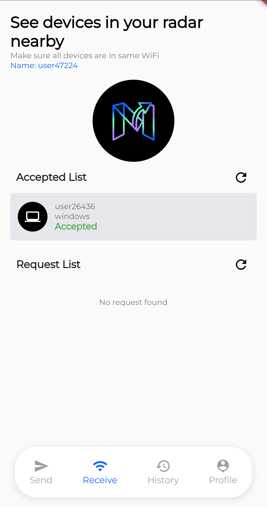
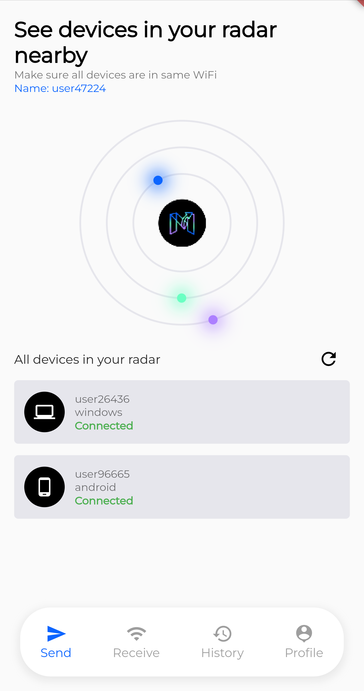
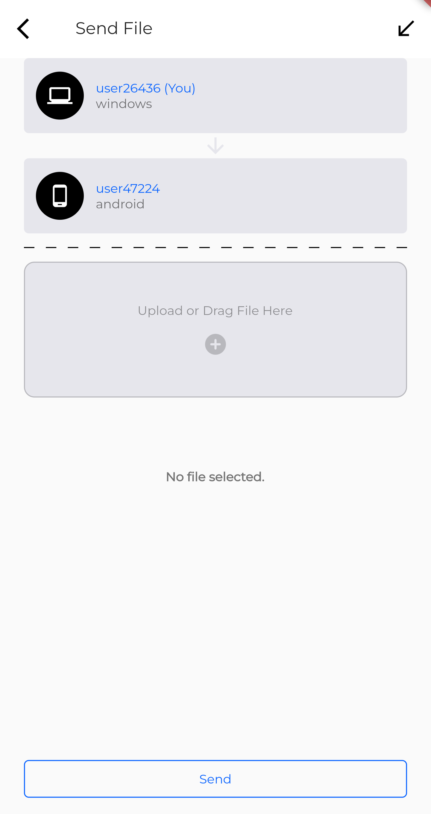
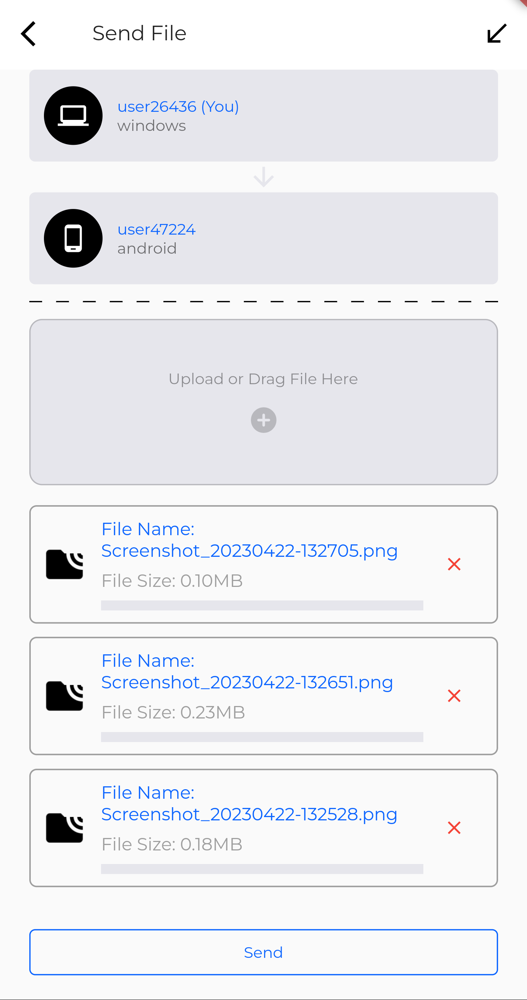

# `MoveIt - File Transfer On Go`

### AirDrop for all Platform (Windows, Linux, Mac, Android, iOS)

## Available at

## Screenshots
<table>
  <tr>
    <td></td>
    <td></td>
  </tr>
  <tr>
    <td></td>
    <td></td>
  </tr>
</table>

## Description

`MoveIt - File Transfer On Go` is a File Sharing App for all Platform (Windows, Linux, Mac, Android,
iOS). It can be used as a replacement for AirDrop.
A lot of people are using AirDrop to share files between their devices. But, AirDrop is only
available for Mac and iOS. So, I created `MoveIt - File Transfer On Go` to share files between all
devices.

## How to use

1. Download the App
2. Open the App
3. Click on the "Refresh" icon button
4. Select the device you want to share files with
5. Click on the "Send" icon button
6. Select the files you want to share
7. Click on the "Send" button

### Platform Support

- Windows
- Linux
- Mac
- Android
- iOS

## Contributing Guide

[Contributing Guide](https://github.com/debojyoti452/move_it_file_transfer/blob/main/CONTRIBUTING.md)

## License

Licensed under
the [GNU General Public License v3.0](https://github.com/debojyoti452/move_app/blob/main/LICENSE)

## Privacy Notice

https://4shorturl.app/hm117

## Contributors

- [Debojyoti Singha](https://debojyoti452.com)

## Author

- [Debojyoti Singha](https://debojyoti452.com)

## Support

- Email: support@swingtechnologies.in
- Website: https://www.swingtechnologies.in
