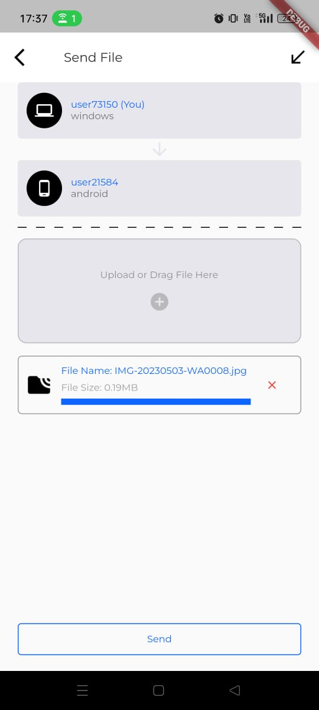
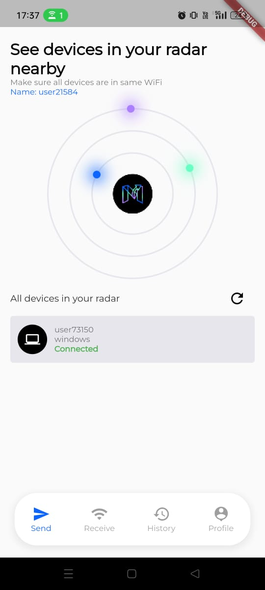

# `MoveIt - File Transfer On Go 📡🔥`

### AirDrop for all Platform (Windows, Linux, Mac, Android, iOS)
  

  

## Please support this initiative by giving this project a star ⭐️

## Please support this initiative by giving this project a star ⭐️

  

## Demo
### Windows device paired with android device both connected by a same localhost

https://user-images.githubusercontent.com/91400483/236869147-063d0896-669a-4ab3-a058-63ec9e64a4ce.mp4

<table align="center">
  <tr>
    <td></td>
    <td></td>
  </tr>
</table>

## Available at

MoveIt App can be downloaded from the links below:

<table>
  <tr>
    <th>Platforms</th>
    <th>Download links</th>
  </tr>
  
  <tr>
    <td>Android Mobile</td>
    <td>
    </td>
  </tr>

  <tr>
    <td>iOS Mobile</td>
    <td>coming soon...</td>
  </tr>

  <tr>
    <td>Windows</td>
    <td></td>
  </tr>

  <tr>
    <td>Linux</td>
    <td>coming soon...</td>
  </tr>

  <tr>
    <td>MAC OS</td>
    <td>coming soon...</td>
  </tr>
  
</table>

<!-- 

 -->

## Provide Feedback, Report Bugs & Request New Features

Just click on the [Issue tab](https://github.com/debojyoti452/move_it_file_transfer/issues) to raise a new issue in this repo.

## Description

`MoveIt - File Transfer On Go` is a File Sharing App for all Platform (Windows, Linux, Mac, Android,
iOS). It can be used as a replacement for AirDrop.
A lot of people are using AirDrop to share files between their devices. But, AirDrop is only
available for Mac and iOS. So, I created `MoveIt - File Transfer On Go` to share files between all
devices.

## How to use

1. Download the App
2. Open the App
3. Click on the "Refresh" icon button
4. Select the device you want to share files with
5. Click on the "Send" icon button
6. Select the files you want to share
7. Click on the "Send" button

### Platform Support

- Windows
- Linux
- Mac
- Android
- iOS

## 👋Want to contribute to MoveIt?

Get started with [good first issues](https://github.com/debojyoti452/move_it_file_transfer/issues?q=is%3Aissue+is%3Aopen+label%3A%22good+first+issue%22)

## Contributing Guide

[Contributing Guide](https://github.com/debojyoti452/move_it_file_transfer/blob/main/CONTRIBUTING.md)

## Screenshots

<table>
  <tr>
    <td></td>
    <td></td>
  </tr>
  <tr>
    <td></td>
    <td></td>
  </tr>
</table>

## License

Licensed under
the [GNU General Public License v3.0](https://github.com/debojyoti452/move_app/blob/main/LICENSE)

## Privacy Notice

https://4shorturl.app/hm117

## Contributors

- [Debojyoti Singha](https://debojyoti452.com)

## Author

- [Debojyoti Singha](https://debojyoti452.com)

## Support

- Email: support@swingtechnologies.in
- Website: https://www.swingtechnologies.in
